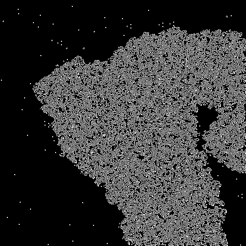

# Update your twitter profile picture based on Conway's Game of Life

### Overview

This code can be used to update your Twitter avatar/profile picture each day with a new time step in <a href="https://en.wikipedia.org/wiki/Conway%27s_Game_of_Life"Conway's Game of LIfe</a>. The first time it's run, it will generate one year of images, and then update your Twitter profile picture with the game of life image for the number of days after initial run. You will need to manually re-run or schedule the script to run each day. It's not the most efficient (runtime wise) implementation of the Game of LIfe, but it was a fun project. I'll likely go back and improve the algorithm later, as well as make the border a circle rather than a square so the entire game will be visible on Twitter without clicking on the profile picture.

Sample images of t=0 and t=364.

### Usage

BEFORE initial run: add your twitter keys to update.py and update the date (d0) with the current date (or date you want to start running from).

Initial run: python update.py

Subsequent runs: either schedule the update.py script to run locally or server side once a day (recommended) or you can manually run it each day. Images only generate the first time unless you update the start date.

